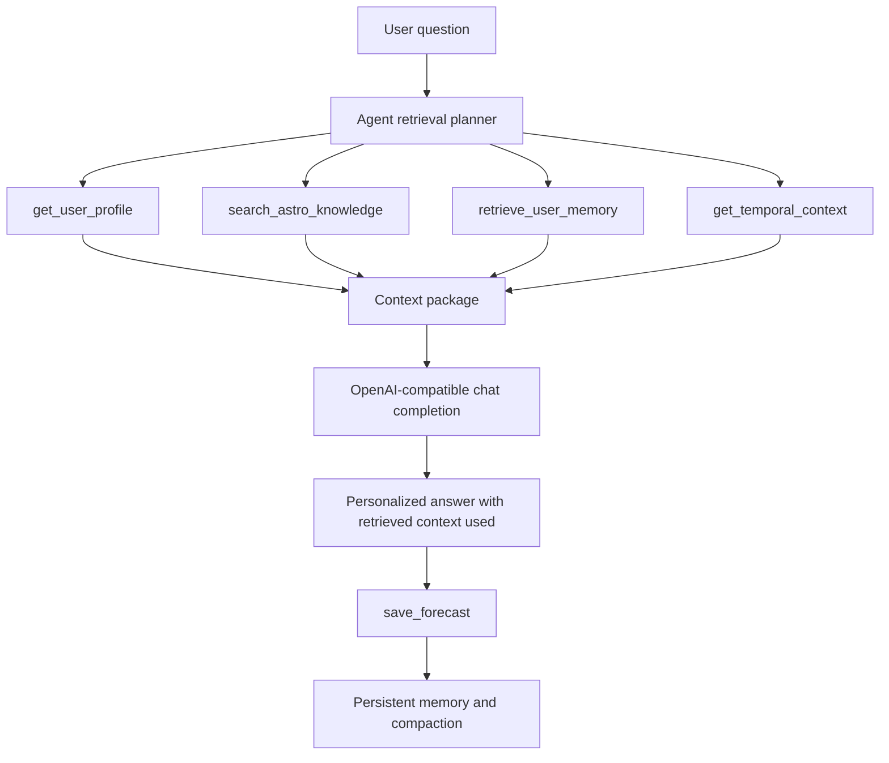

# Horoscope and BaZi Memory Retrieval Agent

The Horoscope and BaZi Memory Retrieval Agent is an information-retrieval augmented personal forecast agent. It uses a playful horoscope domain to demonstrate a serious agent architecture: memory, local knowledge retrieval, temporal context lookup, tool traces, and OpenAI-compatible answer synthesis.

The goal is not to prove astrology. The goal is to show how an AI agent can retrieve context before answering, explain which context it used, and be extended with more IR tools.

## VG-Oriented Features

- **Local knowledge retrieval:** BM25-style search over `data/astro_knowledge.json`.
- **Persistent user memory:** profile, episodic memory, and automatic compaction in `memory/user_memory.json`.
- **Temporal context retrieval:** date-based transit lookup from `data/transits_2026.json`.
- **Visible tool use:** run with `--trace` to see each retrieval/action call.
- **OpenAI-compatible API:** uses `OPENAI_API_KEY`, `OPENAI_BASE_URL`, and `OPENAI_MODEL`.
- **Offline preview:** without an API key, the app still shows retrieved context so the IR flow can be tested.
- **Extensible tools:** add more tools in `src/tools.py`, such as web search, document search, tarot skills, or journal retrieval.

## Architecture



## Quick Start

Requires Python 3.10 or newer.

```bash
python -m venv .venv
.venv\Scripts\activate
pip install -r requirements.txt
```

No external Python packages are required.

### Optional API Configuration

The agent calls an OpenAI-compatible `/chat/completions` endpoint when an API key exists.

PowerShell:

```powershell
$env:OPENAI_API_KEY="your_api_key"
$env:OPENAI_MODEL="gpt-4o-mini"
```

Optional custom endpoint:

```powershell
$env:OPENAI_BASE_URL="https://api.openai.com/v1"
```

## Demo Commands

Set a user profile:

```bash
python src/main.py --profile sun_sign=Leo --profile moon_sign=Virgo --profile focus=study
```

Ask a question and show the tool trace:

```bash
python src/main.py --ask "What should I focus on for study and relationships today?" --date 2026-05-18 --trace
```

Run interactively:

```bash
python src/main.py
```

Run tests:

```bash
python -m unittest discover -s tests
```

## Example Tool Trace

The agent calls:

1. `get_user_profile`
2. `search_astro_knowledge`
3. `retrieve_user_memory`
4. `get_temporal_context`
5. `save_forecast`

This makes the IR process inspectable for the assignment video.

## How This Fits Information Retrieval

The agent improves context through three retrieval channels:

- **Domain IR:** searches astrology concepts, signs, planets, houses, moon phases, and ethical boundaries.
- **Personal IR:** retrieves user profile and relevant prior interactions.
- **Temporal IR:** retrieves date-specific symbolic events.

The final answer is generated only after the agent builds this context package. This is the key difference from a normal chatbot.


## Chinese and BaZi Retrieval

The agent also supports Chinese questions and a small BaZi knowledge base. The BaZi documents cover 八字基础, 五行, 十天干, 十二地支, 日主, 用神, and ethical boundaries. This makes the project a multi-source IR agent: it can retrieve Western astrology context, Chinese metaphysics context, user memory, and temporal context before answering.

Example Chinese demo:

```bash
python src/main.py --profile sun_sign=Leo --profile moon_sign=Virgo --profile focus=学习
python src/main.py --ask "我今天在学习、沟通和感情方面应该注意什么？也请结合八字和五行作为反思角度。" --date 2026-05-20 --trace
```

Natural chat profile demo:

```bash
python src/main.py --ask "我的生日是2001年8月5日，我想关注学习、感情和八字五行。请根据这些信息给我今天的建议。" --date 2026-05-20 --trace
```

The agent will extract `birth_date`, infer the Western sun sign, infer focus topics, save them with `save_user_profile`, and then use those fields during retrieval.

For grading, the important point is that BaZi is used as a searchable cultural knowledge source, not as a deterministic fortune-telling claim.

## Video Demo

Video demo: https://drive.google.com/file/d/1sMczSJjGHewY6A9Zf-VqF-zYQ5gEJ4tR/view?usp=sharing

The 30-second terminal demo shows the agent running with the DeepSeek API. It asks a Chinese question, generates a Chinese answer, and prints the `Tool trace` and `Retrieved context` sections that show profile extraction, memory retrieval, knowledge-base retrieval, temporal context lookup, and forecast saving.

## Extension Ideas

- Add web search for current astronomical/astrology calendar pages.
- Add document upload and search for user journals.
- Add a skill router for horoscope, study coaching, tarot, and weekly planning.
- Add vector embeddings while keeping BM25 as a transparent baseline.
- Add a heartbeat job that generates a daily forecast and stores it in memory.

## Safety Boundary

The agent frames astrology as reflective entertainment and narrative coaching. It should not provide medical, legal, financial, or deterministic predictions.


